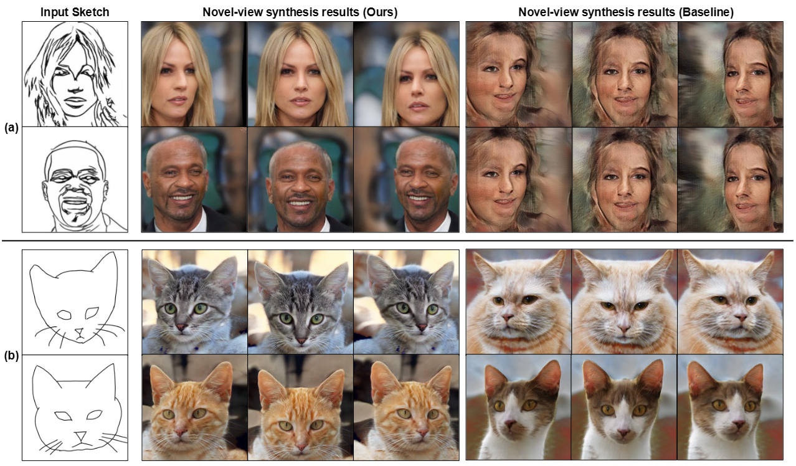
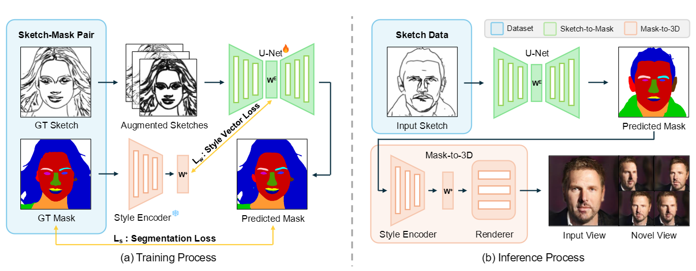

# S3D: Sketch-Driven 3D Model Generation (CVPRW 2025)
This is the official implementation of "S3D: Sketch-Driven 3D Model Generation"




For more details, refer to the [paper](https://arxiv.org/abs/2505.04185).

## Abastact
Generating high-quality 3D models from 2D sketches is a challenging task due to the inherent ambiguity and sparsity of sketch data. In this paper, we present S3D, a novel framework that converts simple hand-drawn sketches into detailed 3D models. Our method utilizes a U-Net-based encoder-decoder architecture to convert sketches into face segmentation masks, which are then used to generate a 3D representation that can be rendered from novel views. To ensure robust consistency between the sketch domain and the 3D output, we introduce a novel style-alignment loss that aligns the U-Net bottleneck features with the initial encoder outputs of the 3D generation module, significantly enhancing reconstruction fidelity. To further enhance the network's robustness, we apply augmentation techniques to the sketch dataset. This streamlined framework demonstrates the effectiveness of S3D in generating high-quality 3D models from sketch inputs.


## Getting Start
```
git clone --recurse-submodules https://github.com/hailsong/S3D.git
```

It will recursively clone the repository of pix2pix3D, which is our baseline.
We further update its key features by inheriting and re-packaging.

```
conda env create -f environment.yml
conda activate sketch2face3d

# Run if there are dependency issues on lpips or torchvision
pip install lpips --no-deps
pip install torchvision==0.11.2+cu111 -f https://download.pytorch.org/whl/torch_stable.html --no-deps
```


## Dataset
We used datasets below.

### Sketch to human task
Multimodal CelebA Dataset : https://github.com/IIGROUP/MM-CelebA-HQ-Dataset

### Sketch to cat tast
AFHQ Dataset : https://github.com/clovaai/stargan-v2/tree/master


## Inference
Coming soon


## Training
Coming soon


## Citation
If you find this repository useful for your research, please cite the following work.
```
# Will be updated soon!
```
